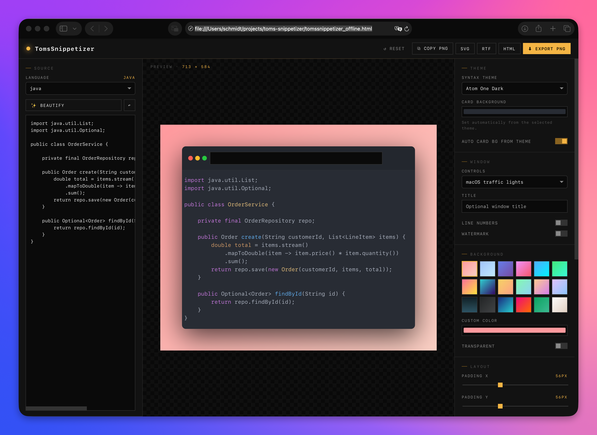

# TomsSnippetizer

> Schöne Code-Screenshots — vollständig offline, ohne einen einzigen Netzwerkaufruf.

TomsSnippetizer ist eine einzelne, in sich geschlossene HTML-Datei (~550 KB), die Quellcode in polierte, exportierbare Bilder, RTF- oder HTML-Dateien verwandelt. Das visuelle Konzept und der Funktionsumfang sind inspiriert von **[carbon.now.sh](https://carbon.now.sh/)**. Die Implementierung wurde mit Hilfe von **[Claude](https://claude.ai/)** von Anthropic entwickelt.

Anders als der Original-Webdienst läuft TomsSnippetizer vollständig im Browser, benötigt zu keinem Zeitpunkt eine Internetverbindung und überträgt nicht ein einziges Byte Ihres Codes nach außen.

> **TomsSnippetizer ist ein unabhängiges Open-Source-Projekt und steht in keiner Verbindung zu Microsoft, Visual Studio oder anderen Unternehmen — es wird von diesen weder unterstützt noch empfohlen.**

---

## Wozu ein weiteres Carbon?

[carbon.now.sh](https://carbon.now.sh/) ist ein hervorragendes Tool, allerdings ein gehosteter Online-Dienst. Wer proprietären, vertraulichen oder sensiblen Quellcode in eine fremde Webseite einfügen will, scheitert oft schon an internen Sicherheitsrichtlinien. TomsSnippetizer ist der lokale Ein-Datei-Ersatz, der dasselbe Look-and-Feel bietet und um die Funktionen ergänzt, die Entwickler und Technical Writer im Lauf der Jahre vermisst haben.

---

---

## Funktionsumfang wie bei carbon.now.sh

* Syntax-Highlighting für **36 Sprachen** ab Werk (Java, Python, Bash, Shell, JSON, XML, YAML, HTML, CSS, SCSS, SQL, Markdown, JavaScript, TypeScript, C, C++, C#, Rust, Go, Kotlin, Swift, Ruby, PHP, Lua, R, Scala, Dockerfile, Makefile, INI, Diff, GraphQL und mehr)
* **23 Syntax-Themes** (Atom One Dark/Light, Dracula, Monokai, Night Owl, Nord, Tokyo Night, GitHub Dark/Light/Dimmed, Gruvbox Dark/Light, Solarized Light, VS 2015, Xcode, A11y Dark/Light, Agate, Obsidian, Paraiso, Tomorrow Night Blue, …)
* Fenster-Chrome: macOS-Ampelsystem, Windows-Steuerung, ohne Buttons oder vollständig ausgeblendet
* Optionaler Fenstertitel
* Zeilennummern
* Zeilenumbruch (Word Wrap) — Fortsetzungszeilen werden mit `↵` markiert
* Wasserzeichen ein-/ausschaltbar
* Hintergrund: 18 Gradient-Voreinstellungen, freier Color-Picker oder transparent
* Karten-Hintergrund automatisch aus dem gewählten Theme abgeleitet (oder manuell setzbar)
* Padding (X/Y), Eckenradius, Schlagschatten, maximale Kartenbreite via Slider
* Schriftart, -größe, Zeilenhöhe
* PNG-Export mit 1×–4×-Pixeldichte
* SVG-Export
* Bild in die Zwischenablage kopieren

## Zusätzliche Features gegenüber Carbon

* **RTF-Export.** Liefert einfügefertiges RTF mit voller Farbübernahme — öffnet direkt in Microsoft Word, Outlook, LibreOffice. Carbon kann das nicht.
* **Eigenständiger HTML-Export.** Erzeugt eine in sich geschlossene `.html`-Datei mit eingebettetem Theme-CSS, sofort einsetzbar auf jeder Webseite. Carbon kann das nicht.
* **Beautify-Button** (`Strg/⌘ + Shift + F`). Mehrsprachiger Code-Formatter, der automatisch zur passenden Engine geroutet wird:
  * js-beautify für JavaScript, TypeScript, HTML, XML, CSS, SCSS, LESS, Sass
  * Natives `JSON.parse` + `JSON.stringify` für JSON / JSON5 (toleriert nachgestellte Kommas)
  * sql-formatter für SQL mit automatischer Dialekt-Erkennung (PostgreSQL / MySQL / T-SQL / Standard)
  * Eigener XML-Formatter, der CDATA, Kommentare, Processing Instructions und Inline-Text korrekt behandelt
  * js-beautify (JS-Modus) für die C-Familie: Java, C, C++, C#, Kotlin, Swift, Rust, Go, Dart, PHP, Objective-C, Scala, Groovy
  * Sicheres Whitespace-Cleanup für einrückungssensitive Sprachen (Python, YAML, Ruby, Bash, Makefile) — verändert *nie* die Einrückung, sondern entfernt nur trailing-Whitespace und reduziert überflüssige Leerzeilen
  * Ein-Klick-Undo (`↶`) stellt den Stand vor dem Beautify wieder her
* **Konfigurierbare Einrückung.** Eine zentrale Einstellung (2 / 4 / 8 Spaces oder Tab-Zeichen) gilt für alle Formatter. Standardwert ist 4 Spaces.
* **Persistente Einstellungen.** Alle UI-Einstellungen (Theme, Fonts, Padding, Schatten, Hintergrund, Indent-Stil etc.) werden automatisch in `localStorage` gesichert und beim nächsten Aufruf wiederhergestellt. Der eingefügte Quellcode wird *niemals* persistiert.
* **Eingebettet, kein CDN.** Alle Bibliotheken (highlight.js, html-to-image, js-beautify, sql-formatter) und sämtliche Theme-Stylesheets sind in die einzige HTML-Datei inline eingebettet. Kein CDN, keine Google Fonts, keine Telemetrie.
* **Nur System-Fonts.** Verwendet weit verbreitete Monospace-Fonts (Consolas, Menlo, SF Mono, DejaVu Sans Mono, …) — keine Webfont-Downloads.
* **Verifizierbare Privatsphäre.** Ein Content-Security-Policy-`<meta>`-Tag mit `connect-src 'none'` blockiert jede ausgehende HTTP-Verbindung auf Browser-Ebene. Ein zur Laufzeit installierter Netzwerk-Monitor hakt sich in `fetch`, `XMLHttpRequest`, `sendBeacon` und `Image.src` ein. Das Privacy-Panel hat einen Button, der jeden Netzwerkversuch seit Seitenstart anzeigt — sollte immer null sein.

---

## Schnellstart

1. Datei `tomssnippetizer_offline.html` herunterladen.
2. Doppelklick. Jeder moderne Browser öffnet sie.
3. Optional: Internetverbindung trennen, um zu verifizieren, dass alles weiter funktioniert.

Es gibt nichts zu installieren, keinen Build-Schritt, kein Node, kein npm.

---

## Privatsphäre und Offline-Garantien

Drei voneinander unabhängige Schutzschichten stellen sicher, dass kein Quellcode jemals Ihre Maschine verlässt:

1. **Keine externen Verweise im Markup.** Keine CDN-URLs, kein `<link>` zu Google Fonts, keine entfernten Skripte. Alles ist inline.
2. **Content-Security-Policy.** Das `<meta>`-Tag im Dokument setzt `connect-src 'none'` und weist den Browser an, jeden `fetch`-, `XHR`-, WebSocket- und EventSource-Versuch abzulehnen — selbst wenn irgendwo im Code einer angesetzt würde.
3. **Laufzeit-Netzwerk-Monitor.** Beim Seitenstart werden `window.fetch`, `XMLHttpRequest.open`, `navigator.sendBeacon` und `new Image().src` durch Wrapper ersetzt, die jeden Aufruf protokollieren. Das Privacy-Panel zeigt das Protokoll auf Knopfdruck an. Ergebnis ist immer: null externe Requests.

`localStorage` wird zur Persistenz von UI-Einstellungen genutzt. Das ist eine rein lokale Browser-API und kein Netzwerkmechanismus. Quellcode ist von der Persistenz ausdrücklich ausgenommen.

---

## Tastaturkürzel

| Kürzel | Aktion |
|--------|--------|
| `Strg/⌘ + S` | PNG exportieren |
| `Strg/⌘ + E` | HTML exportieren |
| `Strg/⌘ + Shift + C` | PNG in die Zwischenablage |
| `Strg/⌘ + Shift + F` | Code formatieren |
| `Tab` (im Editor) | Zwei Leerzeichen einfügen |

---

## Eingebettete Bibliotheken

| Bibliothek | Version | Lizenz | Verwendung |
|------------|---------|--------|------------|
| [highlight.js](https://github.com/highlightjs/highlight.js) | 11.9.0 | BSD-3-Clause | Syntax-Highlighting (36 Sprachen) |
| [html-to-image](https://github.com/bubkoo/html-to-image) | 1.11.11 | MIT | PNG- / SVG-Export |
| [js-beautify](https://github.com/beautify-web/js-beautify) | 1.15.1 | MIT | JS- / HTML- / CSS-Formatierung |
| [sql-formatter](https://github.com/sql-formatter-org/sql-formatter) | 15.4.9 | MIT | SQL-Formatierung |
| highlight.js Themes | 11.9.0 | MIT (überwiegend) | 23 Syntax-Farbschemata |

Jede Bibliothek wird unverändert in ihrer originalen minifizierten Form als `<script>`-Block in die HTML-Datei eingebettet. Gesamtgröße: ~550 KB.

---

## Browser-Unterstützung

Getestet mit aktuellen Versionen von Chrome, Firefox, Safari und Edge. Das `file://`-Protokoll wird vollständig unterstützt — kein Webserver erforderlich.

---

## Aus Quellen bauen

Die ausgelieferte Datei `tomssnippetizer_offline.html` ist die einzige Datei, die Sie brauchen. Wer sie selbst neu bauen möchte (etwa, um weitere Sprachen, Themes oder Fonts hinzuzufügen), findet eine Build-Pipeline, die in einem einzelnen Python-Skript vier npm-Pakete plus Theme-CSS in ein HTML-Template inline einsetzt. Details siehe Build-Skript.

---

## Credits

* Visuelles Konzept und viele UX-Details inspiriert von **[carbon.now.sh](https://carbon.now.sh/)** von Dawn Labs
* Implementierung mit Hilfe von **[Claude](https://claude.ai/)** von Anthropic erstellt
* Eingebettete Open-Source-Bibliotheken — siehe Tabelle oben

---

## Lizenz

MIT — siehe [LICENSE](./LICENSE).

Die eingebetteten Drittanbieter-Bibliotheken behalten ihre Originallizenzen; die LICENSE-Datei führt jede einzeln auf. Eine knappe Komponenten-Übersicht (z. B. für Lizenz-Audit-Tools) findet sich in [NOTICE](./NOTICE).
